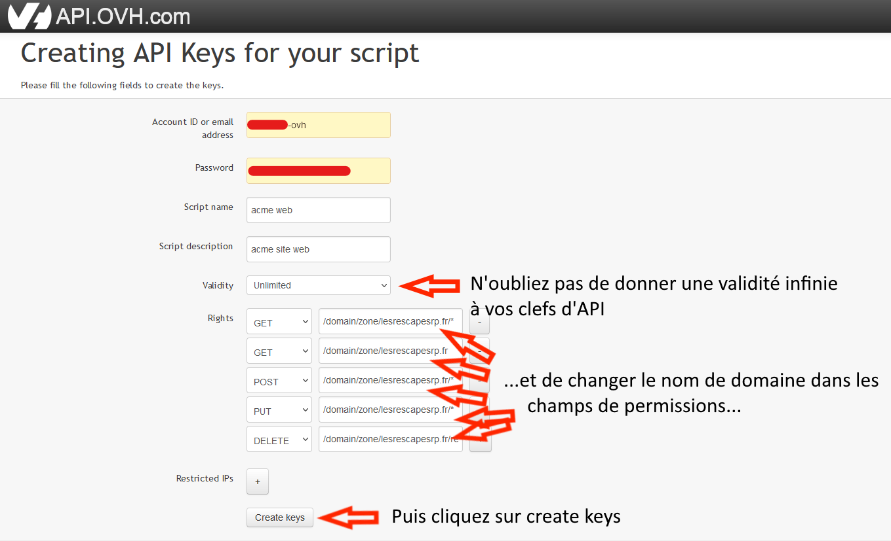
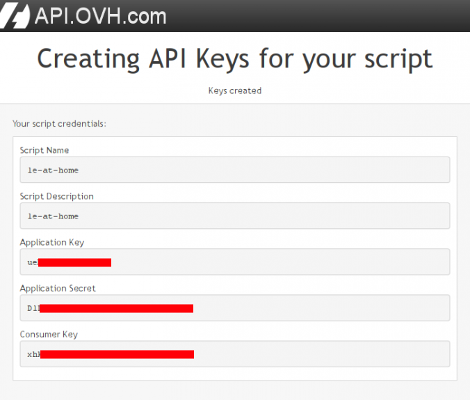
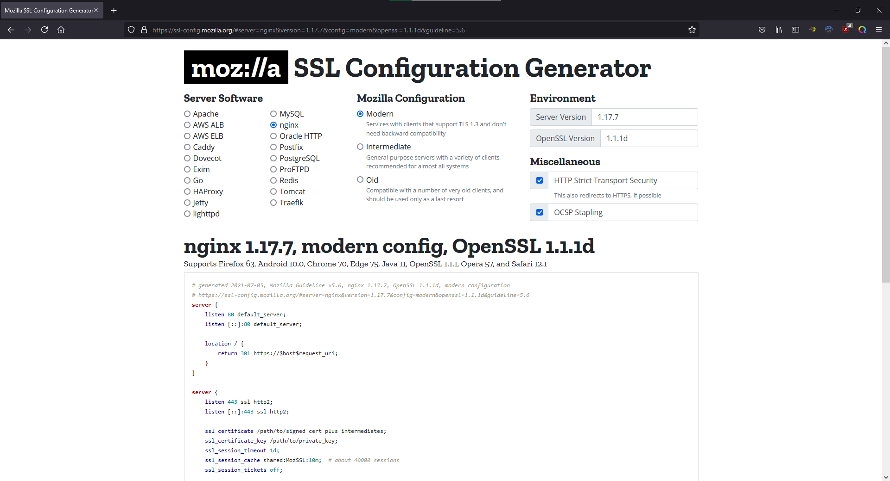
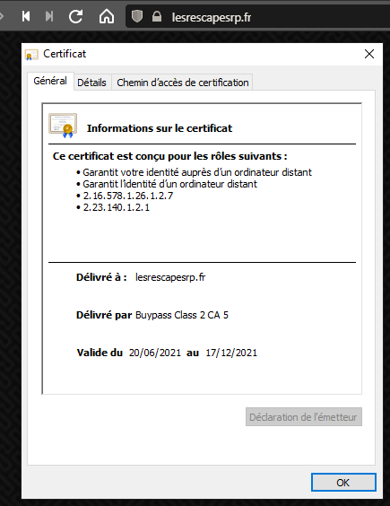

# Serveur web Nginx
- [Serveur web Nginx](#serveur-web-nginx)
  - [Préface](#préface)
  - [Mise en place du système](#mise-en-place-du-système)
  - [Installation de NGINX et de PHP-FPM](#installation-de-nginx-et-de-php-fpm)
    - [Dnf et les modules](#dnf-et-les-modules)
  - [Configuration primaire du site web](#configuration-primaire-du-site-web)
  - [Récupération des clefs d'API OVH](#récupération-des-clefs-dapi-ovh)
    - [Avant toute chose](#avant-toute-chose)
    - [Création des clefs](#création-des-clefs)
  - [Acme.sh](#acmesh)
    - [Installation](#installation)
    - [Enregistrement auprès de l'autorité de certification](#enregistrement-auprès-de-lautorité-de-certification)
    - [Génération des certificats](#génération-des-certificats)
  - [Configuration définitive du site web](#configuration-définitive-du-site-web)
## Préface
[Nginx](https://fr.wikipedia.org/wiki/NGINX) est un serveur web très populaire dans le domaine du cloud pour sa meilleure gestion des fortes charges et pour sa configuration très modulable (il est par ailleurs très bien optimisé pour du [reverse-proxy](https://fr.wikipedia.org/wiki/Proxy_inverse)).

PHP-FPM est le module permettant au serveur web Nginx d'exécuter des pages codées en PHP.

[Acme.sh](https://acme.sh) est un script permettant d'obtenir des certificats pour des serveurs web en exploitant le protocole acme.

Le [CAA](https://fr.wikipedia.org/wiki/DNS_Certification_Authority_Authorization) est un type d'enregistrement DNS permettant à ces derniers de lister les Autorités de Certification (CA) pouvant délivrer un certificat au nom de domaine correspondant.

Dans notre cas, notre système tourne avec un CentOS 8 migré sous AlmaLinux, donc, une base Red Hat.

## Mise en place du système

Dans le cas où l'on viens d'installer / d'obtenir un serveur (dédié physique ou serveur privé virtuel), une mise à jour s'impose. Sous les bases RedHat, on y trouve le gestionnaire de paquet dnf. Concrètement, dnf est aux bases RedHat ce qu'apt est aux bases Debian. Ceci expliqué, je ne vais cependant pas détailler la migration d'une CentOS 8 à AlmaLinux, je vous invite donc à consulter leur [guide de migration](https://github.com/AlmaLinux/almalinux-deploy). 

Pour mettre à jour les paquets sous une base RHEL, exécutez la commande `dnf upgrade -y` dans la console. Dans le cas où vous êtes connecté à un utilisateur non root, mais ayant les permissions sudo, exécutez la même commande précédée de `sudo`.

## Installation de NGINX et de PHP-FPM

Avant d'installer les paquets, une courte notion sur les modules de dnf.

### Dnf et les modules

Dnf permet d'installer différentes versions d'un même paquet. Par défaut, c'est la version encore maintenue la plus mature et déployée qui est installée. Afin de s'assurer qu'il s'agisse de la dernière version de Nginx qui est installée, exécuter les commandes suivantes dans le terminal :

```bash
dnf module nginx switch-to 1.18

dnf install nginx:1.18 -y
```

Ensuite, l'installation de PHP-FPM est très aisée, car il n'y a pas de modules pour cette dernière. Exécutez la commande `dnf install php-fpm -y`

## Configuration primaire du site web

Avant d'avoir un serveur web parfaitement fonctionnel et sécurisé avec l'HTTPS, on va d'abord poser la base du serveur web sur lequel nous allons héberger notre site. Dans notre exemple, il s'agit du site du serveur GTA RP Les Rescapés RP.

Dans les systèmes Linux sous base Debian, les configurations des sites et des hôtes virtuels d'Nginx sont localisés dans `/etc/nginx/sites-available`, et afin de rendre les sites dont leurs configurations sont dans ce répertoire, par convention, un lien symbolique vers le fichier de configuration du site est fait dans `/etc/nginx/sites-enabled`. Un lien symbolique s'utilise de cette façon : `ln -s /etc/nginx/sites-available/kiwindows.fr /etc/nginx/sites-enabled/kiwindows.fr`

Cependant, dans les bases Rhel (RedHat), ces deux répertoires n'existent pas par défaut, il faut donc d'abord créer un répertoire similaire puis configurer Nginx de manière à ce qu'il prenne en compte les fichiers de configuration contenus dans ce nouveau répertoire.

Comme nous allons travailler à présent essentiellement dans le répertoire d'Nginx, on va changer notre terminal de répertoire courant : `cd /etc/nginx`. Ensuite, on va créer ce nouveau répertoire que l'on va nommer "sites" avec la commande `mkdir sites`. Note : si la commande a échouée car vous n'avez pas les permissions, vous devez alors l'exécuter avec les permissions de super-utilisateur. Petit raccourci sous Linux, afin de vous épargner de retaper manuellement la commande, entrez `sudo !!` dans le terminal pour lancer la précédente commande exécutée avec sudo. Sous les systèmes Linux, `!!` représente la dernière commande exécutée, donc dans notre exemple, elle viens à faire `sudo mkdir sites` dans le cas où `mkdir sites` a échoué auparavant.

Ensuite, nous allons modifier le fichier de configuration générale d'Nginx, afin qu'il puisse prendre en compte les fichiers de configuration qui seront dans ce nouveau dossier. Pour cela, nous allons éditer son fichier de configuration avec l'éditeur Nano, qui est un éditeur en ligne de commande sous Linux facile à utiliser, notamment pour les novices. Lancez alors la commande `nano nginx.conf` dans le cas où vous êtes connecté à l'utilisateur root, ou `sudo nano nginx.conf` dans le cas où vous êtes connecté à un utilisateur non-root mais ayant les permissions sudo.

Enfin, dans le fichier de configuration, descendre plus bas jusqu'à trouver le blox "http", puis ajouter la ligne `include /etc/nginx/sites/*;`. N'oubliez pas la tabulation,comme suit sur l'image ci-dessous :


Sauvegarder le fichier en pressant les touches ctrl et x, pressez la touche y pour confirmer, puis entrée pour valider. Le fichier de configuration d'Nginx édité, il va falloir que ce dernier prenne en compte la modification. Mais avant toute chose, il est toujours préférable de demander à Nginx de vérifier si le fichier de configuration fraîchement modifé est correct et ne comporte pas d'erreurs. Pour cela, rentrer dans le terminal la commande `nginx -t`, puis Nginx vous dira si le fichier est valide où s'il comporte une ou des erreurs, et vous dira même où !. Dans notre cas, la modification n'étant pas très poussée, tout devrait bien se passer.

Ainsi, nous pouvons demander à Nginx de recharger son fichier de configuration avec `nginx -s reload`.

Désormais, nous pouvons créer le fichier de configuration de notre site web. Globalement, et à ce stade, une configuration très élémentaire nous suffira amplement. Cette fernière doit nous permettre :
- De définir la localisation des fichiers de notre site (ici `/var/www/lesrescapesrp.fr`, qui est un répertoire que l'on va créer)
- Lui donner des noms d'hôte, qui servira plus tard notamment en ce qui est matière de certificats.
- Le tout de fonctionner sur le port 80, qui est le port par défaut pour de l'HTTP.

De ce fait, nous allons créer le fichier de configuration de notre site web avec `nano sites/lesrescapesrp.fr` (n'oubliez pas le sudo avant si vous n'êtes pas sur l'utilisateur root, mais n'oubliez pas également de nommer votre fichier de site en fonction de vos besoins. Il est courant de nommer le fichier de configuration de votre site avec le nom d'hôte qui va lui être attribué). Enfin, copiez la configuration suivante dans votre éditeur de texte :
```nginx configuration
server {
    listen 80; # Ici on demande à Nginx d'écouter le port sur toutes les adresses IPv4 de toutes les interfaces réseau.
    listen [::]:80; # Idem, mais avec les IPv6 de toutes les interfaces réseau.

    server_name lesrescapesrp.fr www.lesrescapesrp.fr; # On donne deux noms d'hôtes à notre site, car certains navigateurs "forcent" l'utilisation du préfixe www.

    root /var/www/lesrescapesrp.fr; # La localisation de nos fichiers de site web. Notes que "lesrescapesrp.fr" est un répertoire et non un fichier.

    location / {
      index index.html index.php;
    } # Ce bloc ordonne à Nginx, lorsqu'une requête s'adresse à ce serveur web, de retourner en priorité, dans la conditions où ils existent, les fichiers index.html et index.php.
}
```
Évidemment, changez les paramètres dans ce fichier selon vos besoins. Ensuite, il est de coutume de toujours tester nos fichiers de configuration Nginx après avoir opéré à un quelconque changement, avec `nginx -t`. Comme précédemment, si cette commande vous renvoie des erreurs, vérifiez votre configuration. Dans le cas contraire, nous pouvons demander à Nginx de recharger les fichiers de configuration en mémoire pour qu'il prenne en compte les changements avec `nginx -s reload`.

Si le répertoire dans `/var/www` cité plus haut n'est toujours pas créé, faites-le toujours avec la commande mkdir, dans notre cas `mkdir /var/www/lesrescapesrp.fr`. Rappel : dans cette commande, nous mettons le chemin dit absolu du répertoire car pour rappel, nous travaillons toujours présentement dans le répertoire `/etc/nginx` et y resterons dans le sens où nous nous allons être ammenés à éditer à nouveau les configurations d'Nginx plus tard. 2e rappel : adaptez la création de votre répertoire de site en fonction de ce que vous avez précédemment convenu dans le fichier de configuration de votre site.

Enfin, vous pouvez, au choix :
- Directement ajouter vos fichiers de site dans le répertoire nouvellement créé, auquel cas passez par le protocole SFTP qui est non seulement plus sûr mais également plus simple d'utilisation
- Ou alors créer un bref fichier html dans ce répertoire : `nano /var/www/lesrescapesrp.fr/index.html` dans lequel ce dernier contient la seule et unique ligne `<h1>test</h1>`.

Enfin, vous pouvez tester votre site en entrant dans la barre d'URL de votre navigateur l'adresse IP de votre serveur. Normalement, votre navigateur devrait, en fonction de ce que vous avez fait, soit vous renvoyer votre site, soit vous renvoyer un "test" en gros et gras, en haut à gauche de votre fenêtre.

## Récupération des clefs d'API OVH
### Avant toute chose

Attention : cette étape est n'est pas nécessaire pour tout le monde. Veuillez cependant suivre les indications ci-dessous pour de plus amples informations.

Un serveur web qui fonctionne et qui renvoie notre site, c'est bien. Mais devoir donner une adresse IP pour y accéder, c'est moins bien. Mais summum du firmament du comble de l'apogée de l'excès de la connerie à ne pas faire, surtout en 2021 là où ce qui suit est gratuit et facile à mettre en place, en plus de devenir "obligatoire" : laisser son site tourner en HTTP clair, et non en HTTPS, c'est pas seulement pas bien, c'est très moche, vous avez une place attibuée en enfer si vous laissez une chose pareille en production.

Pour pallier ce problème, nous allons déployer des certificats sur notre serveur web. Notez que cette étape de "clefs d'API OVH" n'est nécessaire que dans le cas où vous souhaitez avoir des certificats supportant les wildcard (ex. *.lesrescapesrp.fr, pour avoir pleins de sous-domaines pouvant exploiter ces mêmes certificats), ou que le port 80 (HTTP) n'est pas exploitable pour délivrer un certificat par challenge HTTP. Prenez en compte que ce ne sont pas toutes les Autorités de Certifications qui peuvent délivrer gratuitement des certificats wildcard.

Si vous ne comptez pas exploiter les certificats wildcard et que le port 80 est disponible, je vous invite de ce fait à utiliser le challenge HTTP en suivant le [tutoriel d'acme.sh](https://github.com/acmesh-official/acme.sh#2-just-issue-a-cert)

### Création des clefs

Dans le cas où vous êtes propriétaire de plusieurs domaines, il peut-être pratique de créer une clef API unique permettant de faire des challenge DNS pour tous les domaines: [création d'une clef d'API OVH](https://api.ovh.com/createToken/?GET=/domain/zone/*&POST=/domain/zone/*&PUT=/domain/zone/*&DELETE=/domain/zone/*/record/*).

Cependant, créer une clef API unique par domaine, dont leurs droits sont restreintes au domaine est une bonne pratique de sécurité, car en cas de compromisation du serveur ou des clefs d'API, la casse est plus limitée, ces dernières ne pouvant interragir que dans une zone précise d'un domaine. Pour créer une clef API avec les droits restreints dans un domaine, copiez le lien suivant, en prenant soin de remplacer "votredomaine" par votre nom de domaine (exemple `lesrescapesrp.fr`) : `https://api.ovh.com/createToken/?GET=/domain/zone/votredomaine/*&POST=/domain/zone/votredomaine/*&PUT=/domain/zone/votredomaine/*&GET=/domain/zone/votredomaine&DELETE=/domain/zone/votredomaine/record/*`. Vous devez obtenir un truc de ce genre :



Une fois créées, vous obtenez vos clefs d'API OVH comme ceci :



Notez ces clefs dans un endroit sûr, mais **ne communiquez ces clefs à personne, ne les publiez nulle part sur Internet**. Car quiconque viens à avoir en sa possession ces clefs, **elle sera en mesure de détourner et d'usurper votre nom de domaine**.

## Acme.sh

Pour générer des certificats avec les clefs d'API nouvellement acquises, nous allons utiliser [acme.sh](https://acme.sh). Acme.sh est un script écrit en bash permettant de générer des certificats au sein d'un terminal Linux en exploitant les protocoles standards ACME v1 et ACME v2.

### Installation

Si vous êtes toujours connecté à votre serveur Linux depuis l'installation et la configuration d'Nginx, faites en premier lieu un `cd ~`. Il est recommandé d'exécuter les commande d'acme.sh en tant qu'utilisateur root (et non en tant que simple utilisateur avec les permissions sudo) : `sudo su`. L'installation d'acme.sh est très aisée :
```shell
curl https://get.acme.sh | sh -s email=votre@email.com
```
N'oubliez pas de changer votre adresse email dans la commande avant de l'exécuter.

### Enregistrement auprès de l'autorité de certification

Par défaut, acme.sh, au même titre que tant d'autres script de génération de certificats comme certbot, génèrent des certificats de Let's Encrypt, qui est une Autorité de Certification américaine. Ils ont l'avantage de supporter le [wildcard](https://en.wikipedia.org/wiki/Wildcard_certificate) mais n'ont une durée de validité de seulement 3 mois. Également, la très grande majorité des sites web de particuliers et petites entreprises utilisent des certificats signés par Let's Encrypt qui, derrière, utilise la signature de quelques autres entreprises.

Pour ce tutoriel, nous allons faire signer nos certificats par BuyPass, AC norvégienne qui propose également des certificats gratuits, ayant l'avantage d'avoir une validité de 6 mois (180 jours) et de n'exploiter qu'une seule entreprise en fond en plus d'elle pour signer ses certificats. Cependant, les certificats gratuits de BuyPass ne supportent pas le wildcard pour des mesures de sécurité (idem, un certificat wildcard, dans le cas où il se fait compromettre, peut permettre à une tierce personne d'usurper votre identité en créant des sous-domaines dans votre domaine).

Nous allons ainsi s'enregistrer auprès de BuyPass avec la commande suivante :
```bash
acme.sh --server https://api.buypass.com/acme/directory --register-account  --accountemail votre@email.com
```

### Génération des certificats

Une fois enregistrés, nous pouvons ajouter en variables système les clefs d'API OVH que nous avons précédemment créé. Pour cela, tapez dans votre terminal :
```bash
export OVH_AK="votre_application_key"
export OVH_AS="votre_application_secret"
export OVH_CK="votre_consumer_key"
```
Enfin, vous pouvez générer votre certificat avec la commande suivante :
```bash
acme.sh --server https://api.buypass.com/acme/directory --issue -d lesrescapesrp.fr -d www.lesrescapesrp.fr --days 170 --dns dns_ovh
```
Comme toujours, adaptez en fonction de vos besoins (notamment pour les domaines). Pour chaque domaine à ajouter sur le certificat (vous pouvez en mettre jusqu'à 5 dans le même certificat), ajoutez un -d suivi du domaine / sous-domaine. L'argument `--days 170` définit le délai avant la prochaine régénérartion de certificats. `--dns dns_ovh` indique à acme.sh la méthode à employer pour la génération de certificats, et chez quel registrar le domaine est enregistré.

Patientez le temps que tout procède, cela pouvant prendre quelques longues minutes. Il est possible qu'une erreur (disant un champ txt ne pouvant être supprimé, de mémoire) peut survenir. Cela n'est pas très grave.

Une fois que touta fini de mouliner, vos certificats sont générés ! (dans la condition où tout se passe bien, et que vous avez suivi le tuto à la lettre, en ayant pris soin de bien lire toutes les indications).

Les premiers certificats créés avec succès par acme.sh, ce dernier les renouvellera tous les 170 jours automatiquement comme un grand.

## Configuration définitive du site web

Nos certificats générés, nous devons configurer notre site web afin que ce dernier puisse exploiter les certificats nouvellement générés. Pour cela, nous allons modifier notre fichier de configuration de notre site web avec `nano /etc/nginx/sites/lesrescapesrp.fr`. Vous pouvez vous aider du [générateur de configurations de serveurs web de Mozilla](https://ssl-config.mozilla.org/#server=nginx&version=1.17.7&config=modern&openssl=1.1.1d&guideline=5.6), qui peut vous permettre de générer une configuration en fonction de votre serveur web et de la compatibilité que vous souhaitez donner à votre site web (comme par exemple le rendre accessible depuis des systèmes d'exploitations plus maintenus, comme Windows XP, ou le rendre accessible / compatible uniquement avec des navigateurs modernes, ce que je vous concerne pour la très grande majorité des cas). Le lien fourni précédemment vous permettra de générer une configuration de site web sous Nginx, pour des navigateurs modernes. Bien évidemment, vous devez éditer cette configuration générée afin à ce qu'elle puisse correspondre avec nos besoins :


De ce fait, notre configuration ressemble à ce qui suit :

```nginx
server {
    listen 443 http2 ssl;
    listen [::]:443 http2 ssl;

    server_name lesrescapesrp.fr www.lesrescapesrp.fr;

    access_log /var/log/nginx/lesrescapesrp.fr.access.log;
    error_log /var/log/nginx/lesrescapesrp.fr.error.log;

    ssl_certificate /root/.acme.sh/lesrescapesrp.fr/fullchain.cer;
    ssl_certificate_key /root/.acme.sh/lesrescapesrp.fr/lesrescapesrp.fr.key;
    # Modifiez les chemins d'accès à vos clefs en fonction de vos besoins.
	
	  ssl_session_timeout 1d;
    ssl_session_cache shared:MozSSL:10m;  # about 40000 sessions
    ssl_session_tickets off;

    ssl_prefer_server_ciphers off;
	
    add_header Strict-Transport-Security "max-age=63072000" always;
	
    ssl_stapling on;
    ssl_stapling_verify on;
	
    ssl_trusted_certificate /root/.acme.sh/lesrescapesrp.fr/ca.cer;

    # gzip_types html css jpeg png ico;
    # Cette ligne est parfaitement optionelle. Dans notre cas, elle permet de mettre en cache les fichiers au format html, css, jpeg, png et ico,
    # afin que le serveur puisse réduire les accès disques pour délivrer plus rapidement ces fichiers aux clients qui le demandent.
    # Décommentez-la pour l'exploiter

    location / {
      index index.html index.php;
    }
	
    # location ~ \.php$	{
    #	include snippets/fastcgi-php.conf;
    #	fastcgi_pass unix:/run/php/php7.3-fpm.sock;
    # }
    # Ce bloc de code est nécessaire dans le cas où votre site web contient des pages en PHP, et que ces dernières ne fonctionnent pas.

    root /var/www/lesrescapesrp.fr;
	
    #error_page 404 /404.php;
    #error_page 403 /403.php;
}

server {
    listen 80;
    listen [::]:80;
    server_name lesrescapesrp.fr www.lesrescapesrp.fr;
    return 301 https://$server_name$request_uri;
}
```

Une fois la configuration copiée et modifiée à notre guise, on la sauvegarde, puis nous demandons à Nginx de certifier la validité du fichier de configuration avec `nginx -t`. Toujours dans le cas où vous avez bien suivi ce tutoriel à la lettre, et que vous avez pris le temps de tout bien comprendre comment c'est fait, il ne devrait pas y avoir de problèmes. Auquel cas, Nginx vous le dira.

Nous pouvons ainsi demander à Nginx d'appliquer les changements faits avec `nginx -s reload`, et je vous invite à tester en chargeant votre page web :

